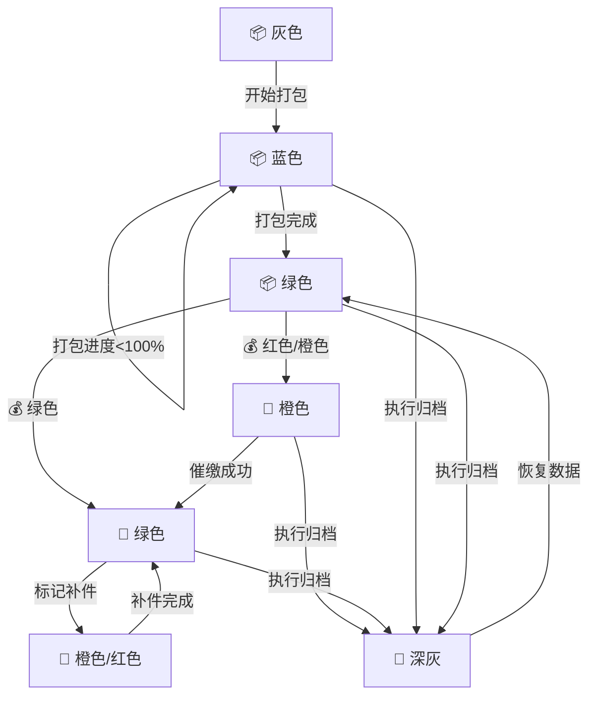

# 客户状态管理设计方案

## 1. 概述

本文档描述了客户状态管理系统的设计方案，包括状态定义、状态转换规则以及 UI 展示规范。

## 2. 状态定义

### 2.1 状态分类

基于业务流程和客户需求，客户状态主要分为以下几类：

- 打包状态（基础前提）
- 定金状态（影响出货范围）
- 出货状态（由定金状态决定）
- 补件状态（基于出货状态）
- 归档状态（独立操作）

### 2.2 状态详情

| 状态类型 | 状态值       | 图标 | 颜色           | 描述       |
| -------- | ------------ | ---- | -------------- | ---------- | ------------ |
| 打包状态 | unpacked     | 📦   | 灰色 (#90A4AE) | 未开始打包 |
| 打包状态 | packing      | 📦   | 蓝色 (#4FC3F7) | 打包进行中 |
| 打包状态 | packed       | 📦   | 绿色 (#66BB6A) | 打包完成   |
| 打包状态 | archived     | 📦   | 深灰 (#546E7A) | 已归档     |
| 定金状态 | unpaid       | 💰   | 红色 (#EF5350) | 未支付定金 |
| 定金状态 | insufficient | 💰   | 橙色 (#FFCA28) | 定金不足额 |
| 定金状态 | sufficient   | 💰   | 绿色 (#66BB6A) | 定金足额   |
| 出货状态 | unshipped    | 🚚   | 灰色 (#90A4AE) | 未安排出货 |
| 出货状态 | partial      | 🚚   | 橙色 (#FFCA28) | 部分出货   | 记录板件 id  |
| 出货状态 | shipped      | 🚚   | 绿色 (#66BB6A) | 全部出货   | 记录包裹信息 |
| 补件状态 | none         | 🔧   | 灰色 (#90A4AE) | 无补件需求 |
| 补件状态 | partial      | 🔧   | 橙色 (#FFCA28) | 部分补件   |
| 补件状态 | full         | 🔧   | 红色 (#EF5350) | 全部补件   |

## 3. 状态展示规范

### 3.1 列表页展示

在列表页中，采用双维度状态展示系统：

1. 核心问题状态：显示当前最需要关注的状态
2. 流程状态图标序列：显示各环节状态（仅图标，通过颜色区分程度）

示例：

```
⚠️ 定金不足额
📦 🚚 🔧
```

### 3.2 详情页展示

在详情页中，提供更详细的状态信息：

1. 核心问题状态：突出显示当前主要问题
2. 流程状态可视化：图标下方显示状态类型文字
3. 状态详情：显示具体状态信息

示例：

```
┌───────────────────────────────────────────────────────┐
│  ⚠️ 定金不足额                                     │
│  500/2000元 (25%)                                  │
│  [立即催缴] [查看详情]                             │
├───────────────────────────────────────────────────────┤
│  📦  🚚  🔧                                         │
│  打包 出货 补件                                    │
│  100% 部分 无                                      │
└───────────────────────────────────────────────────────┘
```

## 4. 状态计算逻辑

### 4.1 打包状态计算

打包状态仅基于板件数据打包进度，不受定金状态影响：

- packProgress = 0% → unpacked
- 0% < packProgress < 100% → packing
- packProgress = 100% → packed

### 4.2 定金状态计算

定金状态基于以下规则：

- 定金 ≥ 500 元 且 定金 ≥ 订单总额的 30% → sufficient
- 否则 → insufficient
- 未支付任何定金 → unpaid

### 4.3 出货状态计算

出货状态完全由定金状态决定：

- sufficient → shipped
- insufficient/unpaid → partial

### 4.4 补件状态规则

- 未出货状态不可标记补件
- 部分出货只能标记部分补件
- 全部出货可标记部分或全部补件

## 5. 状态转换规则

### 5.1 有效性规则

| 打包状态 | 定金状态     | 出货状态  | 补件状态 | 是否有效 |
| -------- | ------------ | --------- | -------- | -------- |
| unpacked | -            | -         | -        | ✅       |
| packing  | -            | unshipped | none     | ✅       |
| packing  | insufficient | partial   | none     | ✅       |
| packed   | sufficient   | shipped   | none     | ✅       |
| packed   | sufficient   | shipped   | partial  | ✅       |
| packed   | insufficient | partial   | full     | ❌       |
| unpacked | \*           | \*        | \*       | ❌       |
| packed   | sufficient   | unshipped | partial  | ❌       |

### 5.2 转换流程



## 6. 业务规则

### 6.1 定金判定标准

定金足额需同时满足：

1. 定金金额 ≥ 500 元
2. 定金比例 ≥ 订单总额的 30%

### 6.2 出货决策规则

- sufficient → 允许全部出货 (shipped)
- insufficient/unpaid → 仅允许部分出货 (partial)
- 未打包不可出货

### 6.3 补件处理规则

- 未出货：合并到原始 XML（更新原文件）
- 已出货：生成新的补件 XML 文件
- 补件 XML 必须包含完整客户信息并添加补件标识字段

### 6.4 归档规则

- 只有打包完成的客户可归档
- 归档操作与定金状态无关
- 打包状态计算中不得引入定金判断
