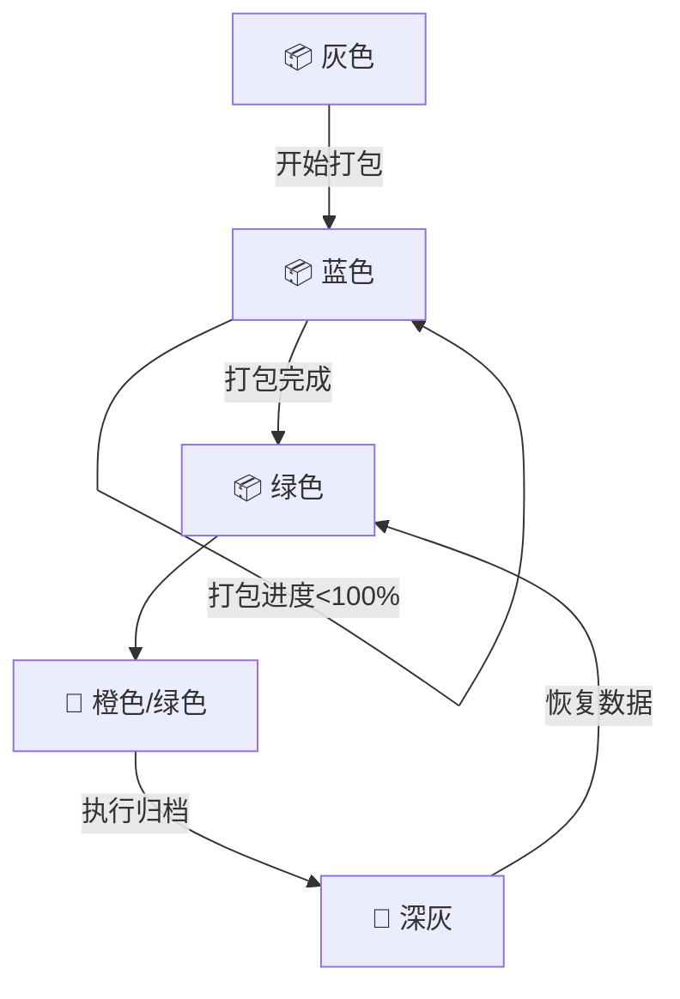

# 客户状态设计文档

## 1. 概述

本文档描述了客户状态管理系统的设计方案，包括状态定义、状态转换规则以及UI展示规范。根据最新需求，系统包含打包状态、出货状态和归档状态三个核心维度。

## 2. 状态定义

### 2.1 状态分类

基于业务流程和客户需求，客户状态主要分为以下几类：
- 打包状态（基础前提）
- 出货状态（独立决策）
- 归档状态（独立操作）

### 2.2 状态详情

| 状态类型 | 状态值    | 图标 | 颜色           | 描述       |
| -------- | --------- | ---- | -------------- | ---------- |
| 打包状态 | unpacked  | 📦   | 灰色 (#90A4AE) | 未开始打包 |
| 打包状态 | packing   | 📦   | 蓝色 (#4FC3F7) | 打包进行中 |
| 打包状态 | packed    | 📦   | 绿色 (#66BB6A) | 打包完成   |
| 打包状态 | archived  | 📦   | 深灰 (#546E7A) | 已归档     |
| 出货状态 | unshipped | 🚚   | 灰色 (#90A4AE) | 未安排出货 |
| 出货状态 | partial   | 🚚   | 橙色 (#FFCA28) | 部分出货   |
| 出货状态 | shipped   | 🚚   | 绿色 (#66BB6A) | 全部出货   |

## 3. 状态展示规范

### 3.1 列表页展示

在列表页中，采用双维度状态展示系统：
1. 核心问题状态：显示当前最需要关注的状态
2. 流程状态图标序列：显示各环节状态（仅图标，通过颜色区分程度）

示例：
```
📦 打包完成
📦 🚚
```

### 3.2 详情页展示

在详情页中，提供更详细的状态信息：
1. 核心问题状态：突出显示当前主要问题
2. 流程状态可视化：图标下方显示状态类型文字
3. 状态详情：显示具体状态信息

示例：
```
┌───────────────────────────────────────────────────────┐
│  📦 打包完成                                        │
│  进度: 100%                                          │
│  [安排出货] [查看详情]                             │
├───────────────────────────────────────────────────────┤
│  📦  🚚                                            │
│  打包 出货                                         │
│  100% -                                           │
└───────────────────────────────────────────────────────┘
```

## 4. 状态计算逻辑

### 4.1 打包状态计算
打包状态仅基于板件数据打包进度：
- packProgress = 0% → unpacked
- 0% < packProgress < 100% → packing
- packProgress = 100% → packed

### 4.2 出货状态计算
出货状态由业务人员手动设置，不再受其他状态影响：
- 可根据实际业务情况选择全部出货或部分出货
- 未打包不可出货

## 5. 状态转换规则

### 5.1 有效性规则
| 打包状态 | 出货状态  | 是否有效 |
| -------- | --------- | -------- |
| unpacked | -         | ✅       |
| packing  | unshipped | ✅       |
| packed   | unshipped | ✅       |
| packed   | partial   | ✅       |
| packed   | shipped   | ✅       |
| unpacked | \*        | ❌       |

### 5.2 转换流程


## 6. 业务规则

### 6.1 出货决策规则
- 打包完成后可根据实际业务情况安排出货
- 可选择全部出货或部分出货
- 未打包不可出货

### 6.2 归档规则
- 只有打包完成的客户可归档
- 归档操作与出货状态无关