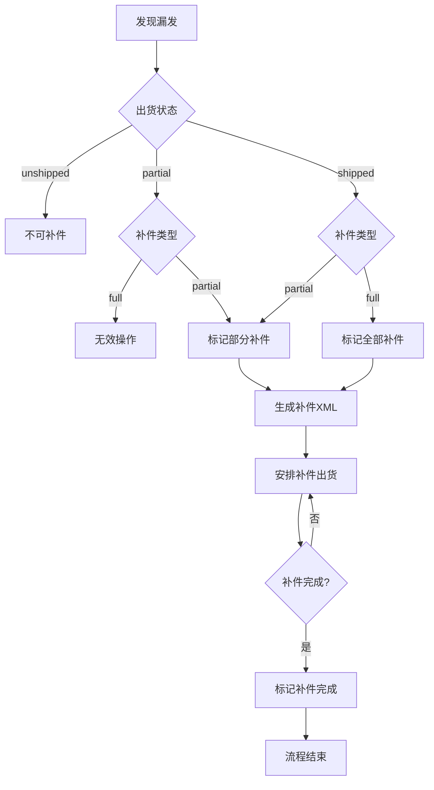

# 补件处理系统设计方案

## 1. 概述

本文档描述了补件处理系统的设计方案，包括补件状态定义、处理流程、XML生成规则等。

## 2. 补件状态定义

### 2.1 补件状态分类

补件状态基于出货状态，分为以下几类：
- 无补件 (none)
- 部分补件 (partial)
- 全部补件 (full)

### 2.2 补件状态详情

| 状态值 | 图标 | 颜色 | 描述 |
|--------|------|------|------|
| none | 🔧 | 灰色 (#90A4AE) | 无补件需求 |
| partial | 🔧 | 橙色 (#FFCA28) | 部分补件 |
| full | 🔧 | 红色 (#EF5350) | 全部补件 |

## 3. 补件处理流程

### 3.1 补件触发条件

1. 客户已出货（shipped 或 partial）
2. 发现出货产品不完整或存在质量问题
3. 客户反馈漏发或错发

### 3.2 补件状态规则

| 出货状态 | 可标记补件状态 | 说明 |
|----------|----------------|------|
| unshipped | none | 未出货不可标记补件 |
| partial | partial | 部分出货只能标记部分补件 |
| shipped | partial/full | 全部出货可标记部分或全部补件 |

## 4. XML处理规则

### 4.1 未出货状态下的处理

- 处理方式：合并到原始XML
- 操作：更新原始XML文件
- 客户信息：无需特殊处理

### 4.2 已出货状态下的处理

- 处理方式：生成新XML文件
- 操作：创建全新的补件XML
- 客户信息：必须补齐完整客户信息

### 4.3 补件XML要求

1. 必须包含完整的客户信息
2. 仅包含需要补件的板件数据
3. 添加补件标识字段
4. 关联原始出货记录

### 4.4 XML文件结构

```xml
<?xml version="1.0" encoding="UTF-8"?>
<CustomerOrder type="replacement">
  <CustomerInfo>
    <ID>客户ID</ID>
    <Name>客户名称</Name>
    <Address>客户地址</Address>
    <Contact>联系人</Contact>
    <Phone>联系电话</Phone>
  </CustomerInfo>
  <Parts>
    <Part>
      <ID>板件ID</ID>
      <Quantity>数量</Quantity>
      <Description>描述</Description>
    </Part>
  </Parts>
  <ReplacementInfo>
    <ReplacementType>partial/full</ReplacementType>
    <OriginalShipmentID>原始出货ID</OriginalShipmentID>
    <MarkedAt>标记时间</MarkedAt>
    <Reason>补件原因</Reason>
  </ReplacementInfo>
</CustomerOrder>
```

## 5. 界面展示规范

### 5.1 列表页展示

在列表页中，补件状态通过图标颜色显示：
- 灰色 🔧：无补件
- 橙色 🔧：部分补件
- 红色 🔧：全部补件

### 5.2 详情页展示

在详情页中，提供详细补件信息：
```
┌───────────────────────────────────────────────────────┐
│  🔧 部分补件                                        │
│  需补件板件: 2件 (P1001, P1002)                     │
│  [生成补件XML] [标记完成] [查看详情]                │
├───────────────────────────────────────────────────────┤
│  📦  🚚  🔧                                         │
│  打包 出货 补件                                    │
│  100% 全部 部分                                    │
└───────────────────────────────────────────────────────┘
```

## 6. 业务规则

### 6.1 补件状态有效性

1. 未出货状态不可标记补件
2. 部分出货状态只能标记部分补件
3. 全部出货状态可标记部分或全部补件

### 6.2 补件XML生成规则

1. 仅已出货客户可生成补件XML
2. 补件XML必须包含完整客户信息
3. 补件XML需添加补件标识字段
4. 补件XML需关联原始出货记录

### 6.3 补件处理流程



## 7. 技术实现

### 7.1 补件状态计算

```javascript
/**
 * 计算补件状态
 * @param {Object} customer - 客户数据
 * @returns {string} 补件状态
 */
function calculateReplacementStatus(customer) {
  // 未出货状态不可有补件
  if (customer.shippingStatus === 'unshipped') {
    return 'none';
  }
  
  // 部分出货状态只能有部分补件
  if (customer.shippingStatus === 'partial' && customer.replacementStatus === 'full') {
    return 'partial'; // 自动修正为部分补件
  }
  
  return customer.replacementStatus || 'none';
}
```

### 7.2 补件XML生成

```javascript
/**
 * 生成补件XML
 * @param {Object} customer - 客户数据
 * @param {string} replacementType - 补件类型
 * @returns {Object} 生成结果
 */
function generateReplacementXML(customer, replacementType) {
  // 1. 验证出货状态是否允许生成补件
  if (customer.shippingStatus === 'unshipped') {
    throw new Error('未出货客户不可生成补件XML');
  }
  
  // 2. 验证补件类型是否有效
  if (replacementType === 'full' && customer.shippingStatus === 'partial') {
    throw new Error('部分出货客户只能生成部分补件XML');
  }
  
  // 3. 验证客户信息完整性
  validateCustomerInfo(customer);
  
  // 4. 生成XML内容
  const xmlContent = createReplacementXMLContent(customer, replacementType);
  
  // 5. 保存到补件目录
  const xmlFilePath = getReplacementXMLPath(customer);
  fs.writeFileSync(xmlFilePath, xmlContent, 'utf-8');
  
  return {
    filePath: xmlFilePath,
    type: replacementType,
    customerID: customer.id
  };
}
```

## 8. 操作指南

### 8.1 标记补件

1. 确认客户已出货
2. 选择补件类型（部分/全部）
3. 填写补件原因
4. 点击"标记补件"按钮

### 8.2 生成补件XML

1. 确认客户已标记补件
2. 点击"生成补件XML"按钮
3. 系统自动生成补件XML文件
4. 文件保存在指定目录中

### 8.3 补件完成处理

1. 确认补件已出货
2. 点击"标记补件完成"按钮
3. 系统更新客户状态
4. 补件流程结束