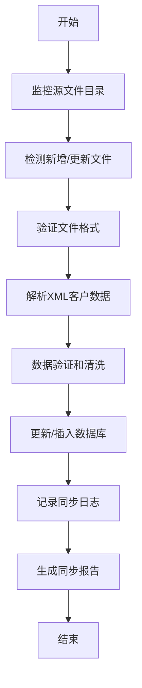
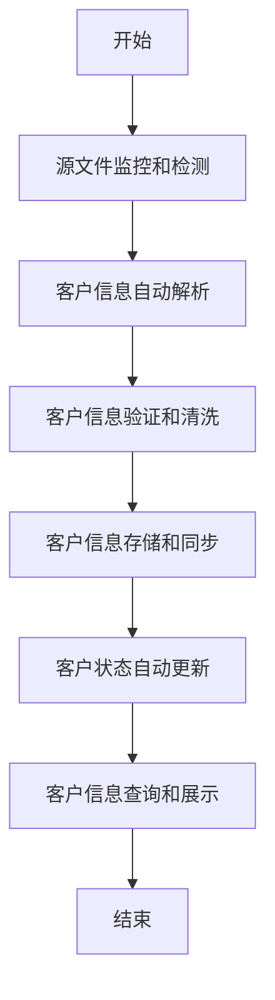
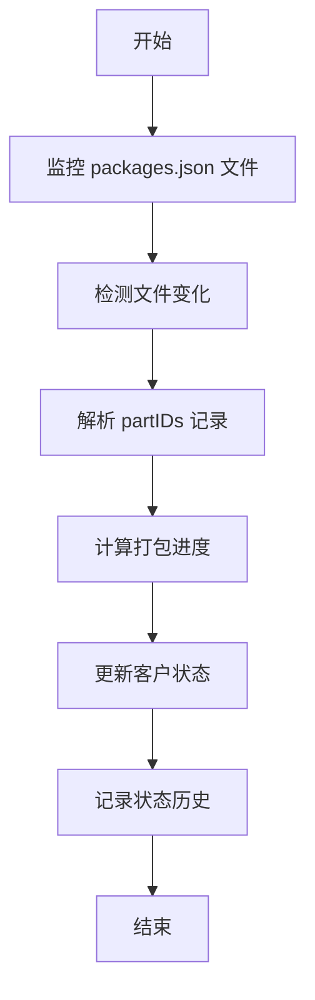
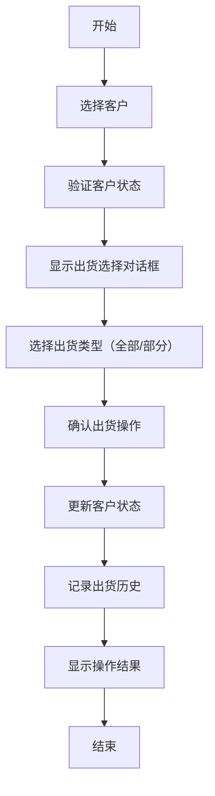
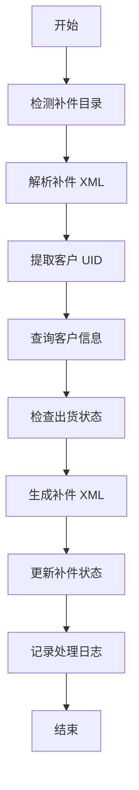
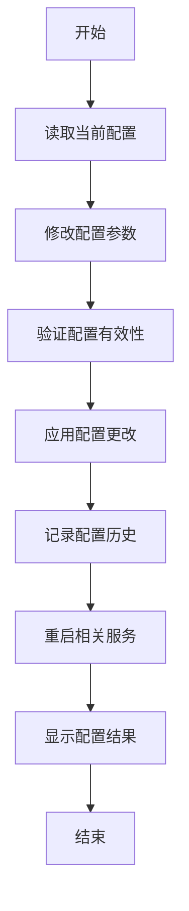
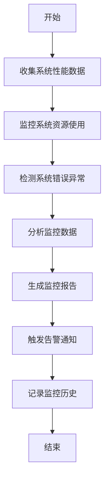
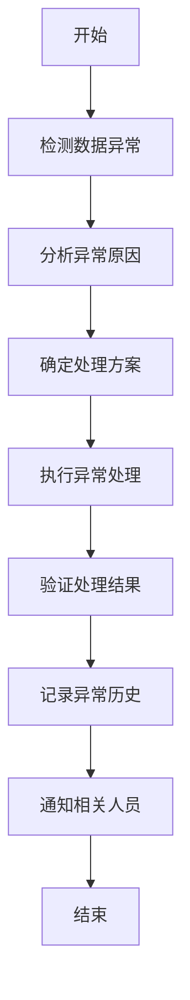
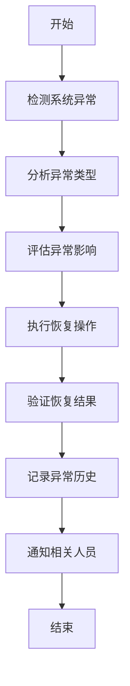

# Pack Node 系统需求文档

## 1. 文档概述

### 1.1 文档目的

本文档详细描述了 Pack Node 系统的功能需求、技术需求和业务流程，为系统开发、测试和维护提供明确的指导。

### 1.2 文档范围

本文档涵盖以下内容：

- 系统总体架构
- 功能模块需求
- 技术实现要求
- 业务流程规范
- 用户界面需求
- 数据管理需求

### 1.3 目标读者

- 系统开发人员
- 测试人员
- 项目管理人员
- 业务分析师
- 系统维护人员

## 2. 系统概述

### 2.1 系统简介

Pack Node 是一个基于 Node.js 和 Electron 的客户数据管理和打包处理系统。系统主要用于管理客户数据、跟踪打包状态、处理出货流程和补件管理。

### 2.2 系统目标

- 实现客户数据的自动化管理
- 提供打包状态的实时监控
- 支持出货流程的完整管理
- 实现补件处理的自动化
- 提供友好的用户界面

### 2.3 系统架构

#### 2.3.1 技术架构

- **前端框架**: Electron + HTML/CSS/JavaScript
- **后端框架**: Node.js + Express
- **数据库**: SQLite
- **文件处理**: 文件系统监控 + XML 解析
- **进程通信**: IPC (Inter-Process Communication)

#### 2.3.2 模块架构

```
Pack Node System
├── 用户界面层 (UI Layer)
│   ├── 主界面 (Main Window)
│   ├── 客户列表 (Customer List)
│   ├── 状态管理 (Status Management)
│   └── 操作界面 (Operation Interface)
├── 业务逻辑层 (Business Logic Layer)
│   ├── 客户状态管理器 (Customer Status Manager)
│   ├── 出货管理器 (Shipping Manager)
│   ├── 补件管理器 (Replacement Manager)
│   ├── 数据管理器 (Data Manager)
│   ├── 客户数据处理器 (Customer Data Processor)
│   └── 包数据提取器 (Package Data Extractor)
├── 数据访问层 (Data Access Layer)
│   ├── 客户数据访问 (Customer Data Access)
│   ├── 状态历史访问 (Status History Access)
│   ├── 配置数据访问 (Configuration Data Access)
│   └── XML 数据解析器 (XML Data Parser)
└── 基础设施层 (Infrastructure Layer)
    ├── 增强文件监控器 (Enhanced File Watcher)
    ├── 数据库连接 (Database Connection)
    ├── IPC 通信 (IPC Communication)
    ├── 日志系统 (Logging System)
    └── 配置管理器 (Configuration Manager)
```

#### 2.3.3 核心工作流程

```
源文件监控 → 客户数据自动提取 → 状态自动计算 → 数据同步存储 → UI实时更新
    ↓                    ↓                    ↓                    ↓                    ↓
  目录变化检测 → XML文件解析 → 打包进度计算 → 数据库更新 → 界面刷新
```

## 3. 功能需求

### 3.1 客户数据管理

#### 3.1.1 客户信息管理

**需求描述**: 系统通过自动化机制管理客户基本信息，完全基于源文件自动获取和处理，无需手动干预。客户信息从 XML 源文件中自动解析，并通过文件监控器实时同步更新。

**核心机制**:

- **自动化监控**: 系统启动时自动启动文件监控器，实时监控源目录变化
- **自动发现**: 自动检测新增客户目录，无需手动添加
- **自动处理**: 发现新客户后自动处理 XML 文件，提取客户信息
- **实时同步**: 源文件变化时自动更新客户状态和数据
- **错误恢复**: 处理失败时自动记录错误并支持重试

**功能要求**:

- 支持源目录的实时监控和变化检测
- 支持客户目录的自动发现和处理
- 支持 XML 文件的自动解析和数据提取
- 支持客户信息的实时更新和同步
- 支持客户信息的查询和筛选
- 支持客户信息的导出功能
- 支持处理失败的错误记录和重试机制

**数据来源和处理流程**:

```
源目录监控 → 客户目录发现 → XML文件解析 → 数据提取和验证 → 状态计算 → 数据存储
    ↓            ↓            ↓            ↓            ↓          ↓
实时检测变化  自动识别客户  多解析器容错  数据清洗和校验  进度计算  数据库更新
```

**详细处理机制**:

- **源目录监控**: 使用增强文件监控器实时监控配置的源目录
- **客户目录识别**: 通过目录命名规则自动识别客户目录（格式：日期\_客户名称）
- **XML 文件处理**: 支持多种 XML 解析器（fast-xml-parser、xml2js、xmldom）容错处理
- **数据提取**: 从 XML 文件中提取 Panel 节点和客户基本信息
- **状态计算**: 基于打包进度自动计算客户状态（未打包/正在处理/已打包）
- **数据同步**: 处理结果自动同步到数据管理器和 UI 界面

**数据字段**:

```json
{
  "id": "客户唯一标识符",
  "name": "客户名称",
  "sourcePath": "源文件目录路径",
  "outputPath": "输出目录路径",
  "status": "客户状态",
  "packProgress": "打包进度百分比",
  "packedCount": "已打包部件数量",
  "totalParts": "总部件数量",
  "packSeqs": "打包序列号数组",
  "lastUpdate": "最后更新时间",
  "packDate": "打包完成时间",
  "shipmentDate": "出货时间",
  "archiveDate": "归档时间",
  "statusHistory": "状态变更历史",
  "replacementStatus": "补件状态",
  "replacementHistory": "补件历史",
  "success": "处理是否成功",
  "remark": "备注信息",
  "createTime": "创建时间",
  "updateTime": "更新时间"
}
```

#### 3.1.2 客户状态管理

**需求描述**: 系统通过自动化机制实时跟踪和管理客户的各种状态，包括打包状态、出货状态、归档状态等。状态管理完全基于文件监控和自动计算，确保数据的实时性和准确性。

**状态定义**:

- **打包状态**: NOT_PACKED（未打包）、PACKING（正在处理）、PACKED（已打包）、ARCHIVED（已归档）
- **出货状态**: UNSHIPPED（未出货）、PARTIAL_SHIPPED（部分出货）、SHIPPED（全部出货）
- **补件状态**: NONE（无补件）、PARTIAL（部分补件）、FULL（全部补件）

**自动化状态管理机制**:

```
文件监控 → 数据提取 → 状态计算 → 状态更新 → 历史记录 → UI同步
    ↓         ↓         ↓         ↓         ↓        ↓
实时检测  packages.json  进度分析  数据库更新  日志记录  界面刷新
```

**详细状态计算规则**:

- **打包状态计算**:

  - packProgress = 0% → NOT_PACKED
  - 0% < packProgress < 100% → PACKING
  - packProgress = 100% → PACKED
  - 手动归档操作 → ARCHIVED

- **出货状态计算**:

  - 初始状态 → UNSHIPPED
  - 部分出货操作 → PARTIAL_SHIPPED
  - 全部出货操作 → SHIPPED
  - 重新标记为未出货 → UNSHIPPED

- **补件状态计算**:
  - 无补件标记 → NONE
  - 部分补件标记 → PARTIAL
  - 全部补件标记 → FULL

**功能要求**:

- **自动化监控**: 实时监控 packages.json 文件变化，自动触发状态更新
- **智能状态计算**: 基于打包进度自动计算和更新客户状态
- **手动操作支持**: 支持手动状态更新（出货、补件、归档等操作）
- **完整历史记录**: 详细记录所有状态变更的完整历史信息
- **实时查询接口**: 提供高效的状态查询和统计接口
- **错误处理机制**: 状态更新失败时的错误处理和恢复机制
- **UI 实时同步**: 状态变更后自动同步更新 UI 界面显示

**状态更新触发条件**:

- **自动触发**: packages.json 文件内容变化时自动触发
- **手动触发**: 用户进行出货、补件、归档等操作时触发
- **系统触发**: 系统启动时批量处理所有客户数据时触发
- **重试触发**: 处理失败后重试时触发

### 3.2 打包状态管理

#### 3.2.1 打包进度计算

**需求描述**: 系统通过自动化机制实时计算每个客户的打包进度，基于 XML 源文件和 packages.json 文件的深度分析，确保进度数据的准确性和实时性。

**自动化进度计算机制**:

```
XML源文件解析 → 面板数据提取 → 打包状态分析 → 进度计算 → 状态更新
     ↓              ↓              ↓            ↓          ↓
  读取源文件     提取Panel节点   对比打包状态   计算百分比   更新数据库
```

**详细计算逻辑**:

- **数据源分析**:

  - 从 XML 源文件提取所有 Panel 节点数据
  - 解析每个 Panel 的属性和状态信息
  - 读取 packages.json 文件中的打包记录
  - 对比源文件和打包记录的差异

- **进度计算算法**:

  ```javascript
  // 伪代码示例
  function calculatePackProgress(sourceData, packageData) {
    const totalPanels = sourceData.panels.length;
    const packedPanels = packageData.packedPanels.length;
    const progress = (packedPanels / totalPanels) * 100;
    return {
      totalPanels,
      packedPanels,
      unpackedPanels: totalPanels - packedPanels,
      progress: Math.round(progress * 100) / 100,
      lastUpdated: new Date().toISOString(),
    };
  }
  ```

- **状态映射规则**:
  - progress = 0% → 状态设置为 NOT_PACKED
  - 0% < progress < 100% → 状态设置为 PACKING
  - progress = 100% → 状态设置为 PACKED
  - 手动归档操作 → 状态设置为 ARCHIVED

**功能要求**:

- **自动化计算**: 基于文件监控自动触发进度计算
- **批量处理**: 支持系统启动时批量计算所有客户进度
- **实时更新**: 文件变化时实时更新进度数据
- **查询接口**: 提供高效的进度查询和统计接口
- **历史记录**: 详细记录每次进度计算的历史信息
- **错误处理**: 计算失败时的错误处理和重试机制
- **性能优化**: 大量客户数据时的性能优化策略
- **数据验证**: 进度计算结果的准确性和完整性验证

**进度计算触发条件**:

- **文件变化触发**: XML 源文件或 packages.json 文件变化时自动触发
- **系统启动触发**: 系统启动时批量处理所有客户数据
- **手动刷新触发**: 用户手动请求刷新进度数据
- **定时检查触发**: 定期检查数据一致性并重新计算
- **错误重试触发**: 计算失败后自动重试机制

#### 3.2.2 状态历史记录

**需求描述**: 系统需要记录所有状态变更的历史信息，包括变更时间、操作人员、变更原因等。

**功能要求**:

- 记录每次状态变更的详细信息
- 支持状态历史查询
- 支持状态历史导出
- 提供状态变更统计

**历史记录字段**:

```json
{
  "status": "新状态",
  "previousStatus": "原状态",
  "timestamp": "变更时间",
  "operator": "操作人员",
  "remark": "备注信息",
  "packProgress": "打包进度",
  "packedParts": "已打包部件数",
  "totalParts": "总部件数"
}
```

### 3.3 出货管理

#### 3.3.1 出货状态管理

**需求描述**: 系统通过自动化和手动相结合的方式管理客户出货状态，支持全部出货、部分出货和未出货状态的灵活管理，确保出货数据的准确性和可追溯性。

**出货状态自动化管理机制**:

```
状态检查 → 操作确认 → 状态更新 → 历史记录 → 数据同步 → UI更新
    ↓         ↓         ↓         ↓         ↓        ↓
权限验证  用户交互  数据库更新  日志记录  文件同步  界面刷新
```

**出货状态定义**:

- **UNSHIPPED**: 未出货状态，客户数据尚未进行任何出货操作
- **PARTIAL_SHIPPED**: 部分出货状态，客户数据已进行部分出货操作
- **SHIPPED**: 全部出货状态，客户数据已完成全部出货操作

**详细出货操作流程**:

- **全部出货操作**:

  1. 检查客户当前状态（必须为 PACKED 或 PACKING）
  2. 验证用户操作权限
  3. 弹出确认对话框，显示出货详细信息
  4. 用户确认后执行出货操作
  5. 更新客户状态为 SHIPPED
  6. 记录出货历史信息
  7. 同步更新相关数据文件
  8. 触发 UI 界面刷新

- **部分出货操作**:

  1. 检查客户当前状态（必须为 PACKED 或 PACKING）
  2. 验证用户操作权限
  3. 弹出部分出货选择对话框
  4. 用户选择部分出货的面板或部件
  5. 执行部分出货操作
  6. 更新客户状态为 PARTIAL_SHIPPED
  7. 记录部分出货历史信息
  8. 更新相关数据文件
  9. 触发 UI 界面刷新

- **标记为未出货操作**:
  1. 检查客户当前状态（必须为 PARTIAL_SHIPPED 或 SHIPPED）
  2. 验证用户操作权限
  3. 弹出确认对话框，说明重置为未出货的影响
  4. 用户确认后执行重置操作
  5. 更新客户状态为 UNSHIPPED
  6. 记录状态重置历史
  7. 更新相关数据文件
  8. 触发 UI 界面刷新

**功能要求**:

- **状态管理**: 支持全部出货、部分出货、未出货状态的完整管理
- **操作界面**: 提供直观的出货状态选择和操作对话框
- **权限控制**: 基于用户角色的出货操作权限控制
- **历史记录**: 详细记录每次出货操作的完整历史信息
- **数据同步**: 出货状态变更后自动同步更新相关数据文件
- **UI 更新**: 出货操作完成后自动刷新 UI 界面显示
- **错误处理**: 出货操作失败时的错误处理和恢复机制
- **批量操作**: 支持多个客户的批量出货操作

**出货操作前提条件**:

- **状态要求**: 客户状态必须为"PACKED"或"PACKING"
- **权限要求**: 用户必须具有出货操作权限
- **数据完整性**: 客户数据必须完整且有效
- **确认机制**: 出货操作必须经过用户明确确认
- **历史记录**: 所有出货状态变更必须记录详细历史

#### 3.3.2 出货流程管理

**需求描述**: 系统提供完整的自动化出货流程管理，集成状态检查、权限验证、操作确认、数据更新和历史记录等环节，确保出货流程的规范性和数据的一致性。

**自动化出货流程管理机制**:

```
流程启动 → 状态验证 → 权限检查 → 操作确认 → 执行出货 → 数据更新 → 历史记录 → 流程完成
    ↓         ↓         ↓         ↓         ↓         ↓         ↓         ↓        ↓
 用户操作  系统验证  权限控制  界面交互  业务处理  数据同步  日志记录  状态通知
```

**详细出货流程管理**:

- **流程启动阶段**:

  - 用户在 UI 界面选择出货操作
  - 系统接收出货请求并初始化流程
  - 验证请求参数的有效性
  - 准备流程执行所需的数据和资源

- **状态验证阶段**:

  - 检查客户当前状态是否符合出货条件
  - 验证客户数据的完整性和有效性
  - 检查相关文件的存在性和可访问性
  - 确认系统状态允许执行出货操作

- **权限检查阶段**:

  - 验证用户登录状态和身份
  - 检查用户是否具有出货操作权限
  - 根据用户角色限制操作范围
  - 记录权限验证结果

- **操作确认阶段**:

  - 显示出货操作确认对话框
  - 展示详细的出货信息和影响
  - 提供操作备注输入功能
  - 等待用户最终确认

- **执行出货阶段**:

  - 根据用户选择执行相应出货操作
  - 更新客户出货状态信息
  - 处理相关的面板和部件数据
  - 生成出货操作记录

- **数据更新阶段**:

  - 同步更新客户数据库记录
  - 更新相关的 JSON 数据文件
  - 触发文件监控器同步机制
  - 确保数据的一致性和完整性

- **历史记录阶段**:

  - 记录详细的出货操作历史
  - 保存操作时间、操作人员、操作类型
  - 记录操作前后的状态变化
  - 保存操作备注和相关信息

- **流程完成阶段**:
  - 更新 UI 界面显示最新状态
  - 发送操作完成通知
  - 清理流程临时数据
  - 记录流程执行结果

**功能要求**:

- **完整流程**: 提供从启动到完成的完整出货流程管理
- **界面支持**: 提供直观的出货操作界面和确认对话框
- **备注功能**: 支持出货操作的备注信息输入和保存
- **状态查询**: 提供出货状态和历史记录的查询功能
- **统计报表**: 提供丰富的出货统计报表和分析图表
- **流程追踪**: 支持出货流程的实时追踪和状态监控
- **异常处理**: 提供流程异常的处理和恢复机制
- **性能优化**: 大量出货操作时的性能优化策略

**状态转换规则**:

```
[NOT_PACKED] → [PACKING] → [PACKED] → [SHIPPED]
                              |→ [PARTIAL_SHIPPED]
                              |→ [UNSHIPPED]
                              |→ [ARCHIVED] → [SHIPPED]
                                         |→ [PARTIAL_SHIPPED]
                                         |→ [UNSHIPPED]
```

**流程监控指标**:

- **成功率**: 出货流程执行的成功率统计
- **执行时间**: 各阶段执行时间的监控和分析
- **错误率**: 出货流程错误率的统计和分析
- **用户满意度**: 用户对出货流程的满意度反馈
- **系统负载**: 出货操作对系统负载的影响监控

### 3.4 补件管理

#### 3.4.1 补件状态管理

**需求描述**: 系统通过自动化机制管理补件状态，基于出货状态和补件文件分析自动计算和更新补件状态，支持无补件、部分补件和全部补件状态的智能管理。

**补件状态自动化管理机制**:

```
补件检测 → 文件解析 → 状态分析 → 补件计算 → 状态更新 → 历史记录 → UI同步
    ↓         ↓         ↓         ↓         ↓         ↓        ↓
目录监控  XML解析  出货状态分析  补件数量计算  数据库更新  日志记录  界面刷新
```

**补件状态定义**:

- **NONE**: 无补件状态，客户没有需要补件的面板或部件
- **PARTIAL**: 部分补件状态，客户有部分面板或部件需要补件
- **FULL**: 全部补件状态，客户的所有面板或部件都需要补件

**详细补件状态计算规则**:

- **状态映射规则**:

  - UNSHIPPED（未出货）→ NONE（无补件）
  - PARTIAL_SHIPPED（部分出货）→ PARTIAL（部分补件）
  - SHIPPED（全部出货）→ PARTIAL（部分补件）或 FULL（全部补件）

- **自动计算逻辑**:

  ```javascript
  // 伪代码示例
  function calculateReplacementStatus(customerData, replacementFiles) {
    const { shipmentStatus, totalPanels } = customerData;
    const replacementPanels = analyzeReplacementFiles(replacementFiles);

    if (shipmentStatus === 'UNSHIPPED') {
      return 'NONE';
    }

    if (shipmentStatus === 'PARTIAL_SHIPPED') {
      return 'PARTIAL';
    }

    if (shipmentStatus === 'SHIPPED') {
      const replacementRatio = replacementPanels.length / totalPanels;
      if (replacementRatio === 1) {
        return 'FULL';
      } else if (replacementRatio > 0) {
        return 'PARTIAL';
      } else {
        return 'NONE';
      }
    }

    return 'NONE';
  }
  ```

- **补件检测机制**:
  - 自动监控补件目录变化
  - 解析补件 XML 文件内容
  - 提取补件面板的 UID 信息
  - 匹配客户原始数据
  - 计算补件比例和状态

**功能要求**:

- **自动检测**: 自动检测补件目录和文件变化
- **智能计算**: 基于出货状态和补件文件智能计算补件状态
- **状态管理**: 支持补件状态的完整生命周期管理
- **查询接口**: 提供补件状态和历史记录的查询功能
- **历史记录**: 详细记录补件状态变更的完整历史
- **UI 同步**: 补件状态变更后自动同步更新 UI 界面
- **错误处理**: 补件处理失败时的错误处理和恢复机制
- **性能优化**: 大量补件数据时的性能优化策略

**补件状态触发条件**:

- **文件变化触发**: 补件目录或 XML 文件变化时自动触发
- **出货状态触发**: 客户出货状态变更时自动触发
- **系统启动触发**: 系统启动时批量处理补件状态
- **手动刷新触发**: 用户手动请求刷新补件状态
- **定时检查触发**: 定期检查补件数据一致性

#### 3.4.2 补件处理流程

**需求描述**: 系统提供完整的自动化补件处理流程，集成补件检测、文件解析、客户匹配、状态处理、XML 生成和历史记录等环节，确保补件处理的准确性和可追溯性。

**自动化补件处理流程机制**:

```
补件检测 → 文件解析 → UID提取 → 客户匹配 → 状态判断 → XML生成 → 文件保存 → 状态更新 → 历史记录
    ↓         ↓         ↓         ↓         ↓         ↓         ↓         ↓         ↓
目录监控  XML解析  数据提取  数据库查询  出货状态分析  文件生成  路径处理  状态同步  日志记录
```

**详细补件处理流程**:

- **补件检测阶段**:

  - 自动监控补件目录变化
  - 检测新增的补件 XML 文件
  - 验证补件文件的有效性
  - 初始化补件处理流程

- **文件解析阶段**:

  - 使用多解析器策略解析补件 XML 文件
  - 提取补件文件中的 Panel 节点数据
  - 解析每个 Panel 的 UID 和属性信息
  - 验证解析数据的完整性和有效性

- **UID 提取阶段**:

  - 从解析数据中提取所有面板的 UID 信息
  - 去重和清理 UID 数据
  - 验证 UID 格式的正确性
  - 准备客户查询参数

- **客户匹配阶段**:

  - 根据 UID 查询对应的客户信息
  - 验证客户数据的存在性和有效性
  - 检查客户的出货状态
  - 准备补件处理策略

- **状态判断阶段**:

  - 分析客户的当前出货状态
  - 根据出货状态确定补件处理方式
  - 验证补件处理的前提条件
  - 确定 XML 生成策略

- **XML 生成阶段**:

  - **未出货状态处理**:

    - 将补件数据合并到原始 XML 文件
    - 更新原始 XML 中的面板信息
    - 保持原始 XML 结构的完整性
    - 添加补件标识和备注信息

  - **已出货状态处理**:
    - 生成新的补件 XML 文件
    - 包含完整的客户信息
    - 添加补件标识字段
    - 保持与原始 XML 的一致性

- **文件保存阶段**:

  - 确定输出文件路径和名称
  - 执行文件保存操作
  - 验证文件保存的成功性
  - 更新文件索引信息

- **状态更新阶段**:

  - 更新客户的补件状态
  - 同步更新相关数据文件
  - 触发文件监控器同步机制
  - 准备历史记录数据

- **历史记录阶段**:
  - 记录补件处理的详细信息
  - 保存处理时间、处理结果、操作类型
  - 记录处理前后的状态变化
  - 保存相关文件路径和处理备注

**功能要求**:

- **自动检测**: 自动检测补件目录和文件变化
- **智能解析**: 使用多解析器策略智能解析补件 XML 文件
- **精确匹配**: 根据 UID 精确匹配客户信息
- **状态处理**: 根据出货状态智能处理补件数据
- **XML 生成**: 自动生成符合要求的补件 XML 文件
- **完整记录**: 详细记录补件处理的完整历史信息
- **错误处理**: 补件处理失败时的错误处理和恢复机制
- **性能优化**: 大量补件文件时的性能优化策略

**补件处理规则**:

- **未出货状态处理规则**:

  - 将补件数据合并到原始 XML 文件
  - 更新原始 XML 中对应面板的信息
  - 保持原始 XML 结构的完整性
  - 添加补件标识和处理备注
  - 不生成新的补件 XML 文件

- **已出货状态处理规则**:

  - 生成新的补件 XML 文件
  - 补件 XML 必须包含完整的客户信息
  - 添加补件标识字段（isReplacement: true）
  - 保持与原始 XML 的数据结构一致性
  - 文件命名包含补件标识和时间戳

- **数据完整性规则**:
  - 补件 XML 必须包含所有必要的客户信息
  - 面板 UID 必须与原始数据完全匹配
  - 补件标识字段必须明确标识补件性质
  - 文件路径和命名必须符合系统规范
  - 所有数据变更必须记录详细历史

**补件处理触发条件**:

- **文件变化触发**: 补件目录新增 XML 文件时自动触发
- **定时检查触发**: 定期检查补件目录和处理状态
- **手动触发**: 用户手动请求补件处理时触发
- **重试触发**: 补件处理失败后自动重试时触发
- **系统启动触发**: 系统启动时批量处理待处理补件

### 3.5 归档管理

#### 3.5.1 归档操作

**需求描述**: 系统提供完整的客户数据归档管理功能，支持归档、恢复归档、查询和导出等操作，确保归档数据的安全性和可追溯性。

**自动化归档管理机制**:

```
归档申请 → 状态验证 → 权限检查 → 操作确认 → 执行归档 → 数据更新 → 历史记录 → 完成通知
    ↓         ↓         ↓         ↓         ↓         ↓         ↓         ↓
 用户操作  系统验证  权限控制  界面交互  数据处理  状态同步  日志记录  状态通知
```

**归档状态定义**:

- **ACTIVE**: 活跃状态，客户数据正常使用中
- **ARCHIVED**: 已归档状态，客户数据已归档存储
- **RESTORED**: 已恢复状态，归档数据已恢复到活跃状态

**详细归档操作流程**:

- **归档操作流程**:

  1. **归档申请阶段**:

     - 用户在 UI 界面选择归档操作
     - 系统接收归档请求并验证参数
     - 准备归档执行所需的数据和资源

  2. **状态验证阶段**:

     - 检查客户当前状态（必须为 PACKED）
     - 验证客户数据的完整性和有效性
     - 确认客户没有未完成的出货或补件操作

  3. **权限检查阶段**:

     - 验证用户登录状态和身份
     - 检查用户是否具有归档操作权限
     - 根据用户角色限制归档操作范围

  4. **操作确认阶段**:

     - 显示归档操作确认对话框
     - 展示归档的详细信息和影响
     - 提供归档备注输入功能
     - 等待用户最终确认

  5. **执行归档阶段**:

     - 将客户数据移动到归档存储区域
     - 更新客户状态为 ARCHIVED
     - 生成归档记录和索引信息
     - 备份原始数据文件

  6. **数据更新阶段**:

     - 同步更新客户数据库记录
     - 更新相关的 JSON 数据文件
     - 触发文件监控器同步机制
     - 确保数据的一致性和完整性

  7. **历史记录阶段**:

     - 记录详细的归档操作历史
     - 保存操作时间、操作人员、操作类型
     - 记录归档前后的状态变化
     - 保存归档文件路径和备注信息

  8. **完成通知阶段**:
     - 更新 UI 界面显示归档状态
     - 发送归档完成通知
     - 清理归档临时数据
     - 记录归档操作结果

- **恢复归档操作流程**:

  1. **恢复申请阶段**:

     - 用户在归档列表中选择恢复操作
     - 系统接收恢复请求并验证参数
     - 准备恢复执行所需的数据和资源

  2. **数据验证阶段**:

     - 验证归档数据的存在性和完整性
     - 检查归档数据的有效性
     - 确认恢复操作的可行性

  3. **权限检查阶段**:

     - 验证用户恢复操作权限
     - 检查用户角色和权限范围
     - 记录权限验证结果

  4. **操作确认阶段**:

     - 显示恢复操作确认对话框
     - 展示恢复的详细信息和影响
     - 提供恢复备注输入功能
     - 等待用户最终确认

  5. **执行恢复阶段**:

     - 将归档数据恢复到活跃存储区域
     - 更新客户状态为 RESTORED
     - 重建数据索引和关联关系
     - 验证恢复数据的完整性

  6. **状态同步阶段**:

     - 同步更新客户数据库记录
     - 更新相关的 JSON 数据文件
     - 触发文件监控器同步机制
     - 确保数据的一致性和完整性

  7. **历史记录阶段**:

     - 记录详细的恢复操作历史
     - 保存操作时间、操作人员、操作类型
     - 记录恢复前后的状态变化
     - 保存恢复文件路径和备注信息

  8. **完成通知阶段**:
     - 更新 UI 界面显示恢复状态
     - 发送恢复完成通知
     - 清理恢复临时数据
     - 记录恢复操作结果

**功能要求**:

- **归档操作**: 支持完整的客户数据归档操作
- **恢复操作**: 支持归档数据的恢复操作
- **列表查询**: 提供归档数据列表的查询功能
- **数据导出**: 支持归档数据的导出功能
- **权限控制**: 基于用户角色的归档操作权限控制
- **历史记录**: 详细记录归档和恢复操作的完整历史
- **数据验证**: 归档和恢复操作的数据完整性验证
- **错误处理**: 归档操作失败时的错误处理和恢复机制
- **性能优化**: 大量数据归档时的性能优化策略
- **安全保护**: 归档数据的安全保护和访问控制

**归档操作前提条件**:

- **状态要求**: 客户状态必须为"PACKED"（已打包）
- **权限要求**: 用户必须具有归档操作权限
- **数据完整性**: 客户数据必须完整且有效
- **操作确认**: 归档操作必须经过用户明确确认
- **历史记录**: 所有归档操作必须记录详细历史
- **存储空间**: 系统必须有足够的归档存储空间

#### 3.5.2 归档数据管理

**需求描述**: 系统提供完整的归档数据管理功能，包括归档数据的查询、浏览、导出、恢复和统计分析等操作，确保归档数据的可管理性和可访问性。

**自动化归档数据管理机制**:

```
数据查询 → 列表展示 → 详情查看 → 数据导出 → 恢复操作 → 统计分析 → 权限控制 → 日志记录
    ↓         ↓         ↓         ↓         ↓         ↓         ↓         ↓
索引检索  界面渲染  数据加载  格式转换  状态更新  报表生成  访问验证  操作记录
```

**归档数据管理架构**:

- **数据存储层**:

  - 归档数据文件存储
  - 归档索引数据库
  - 归档元数据管理
  - 归档版本控制

- **数据访问层**:

  - 归档数据查询接口
  - 归档数据访问控制
  - 归档数据缓存管理
  - 归档数据索引服务

- **业务逻辑层**:

  - 归档数据查询逻辑
  - 归档数据导出逻辑
  - 归档数据恢复逻辑
  - 归档数据统计逻辑

- **表现层**:
  - 归档数据列表界面
  - 归档数据详情界面
  - 归档数据导出界面
  - 归档数据统计界面

**详细归档数据管理功能**:

- **归档数据查询功能**:

  - **基础查询**: 支持按客户名称、归档时间、归档状态等基础条件查询
  - **高级查询**: 支持多条件组合查询、模糊查询、范围查询等
  - **全文检索**: 支持归档数据的全文检索和关键词搜索
  - **查询优化**: 提供查询性能优化和结果缓存机制
  - **查询历史**: 保存用户查询历史和常用查询条件

- **归档数据列表功能**:

  - **列表展示**: 以表格形式展示归档数据列表
  - **分页支持**: 支持大数据量的分页显示和加载
  - **排序功能**: 支持按各字段进行升序/降序排序
  - **筛选功能**: 支持按状态、时间、类型等条件筛选
  - **批量操作**: 支持批量选择和批量操作功能

- **归档数据详情查看功能**:

  - **详情展示**: 展示归档数据的完整详细信息
  - **结构化显示**: 以结构化方式展示归档数据内容
  - **版本对比**: 支持不同版本归档数据的对比查看
  - **关联数据**: 显示与归档数据相关的其他数据信息
  - **操作历史**: 展示归档数据的操作历史记录

- **归档数据导出功能**:

  - **多格式支持**: 支持导出为 Excel、PDF、CSV、JSON 等多种格式
  - **自定义导出**: 支持自定义导出字段和导出范围
  - **批量导出**: 支持批量导出多个归档数据
  - **导出任务**: 支持大文件导出的任务管理和进度显示
  - **导出历史**: 保存导出历史记录和文件下载链接

- **归档数据恢复功能**:

  - **选择性恢复**: 支持选择部分数据进行恢复操作
  - **恢复预览**: 提供恢复操作的预览和确认机制
  - **冲突处理**: 处理恢复过程中的数据冲突问题
  - **恢复验证**: 恢复完成后进行数据完整性验证
  - **恢复回滚**: 支持恢复操作的回滚和撤销

- **归档数据统计分析功能**:
  - **统计报表**: 提供归档数据的统计报表和分析图表
  - **趋势分析**: 分析归档数据的时间趋势和变化规律
  - **容量分析**: 统计归档数据的存储容量和增长趋势
  - **访问分析**: 统计归档数据的访问频率和访问模式
  - **性能分析**: 分析归档数据管理的性能指标和瓶颈

**功能要求**:

- **数据查询**: 提供高效、灵活的归档数据查询功能
- **列表管理**: 提供完整的归档数据列表管理功能
- **详情查看**: 提供详细的归档数据查看和分析功能
- **数据导出**: 提供多格式、多方式的归档数据导出功能
- **数据恢复**: 提供安全、可靠的归档数据恢复功能
- **统计分析**: 提供丰富的归档数据统计和分析功能
- **权限控制**: 基于用户角色的归档数据访问权限控制
- **性能优化**: 大量归档数据时的性能优化策略
- **安全保护**: 归档数据的安全保护和访问审计
- **日志记录**: 详细记录归档数据管理的操作日志

**归档数据管理触发条件**:

- **用户查询触发**: 用户主动查询归档数据时触发
- **定时统计触发**: 定期执行归档数据统计任务时触发
- **系统维护触发**: 系统维护时触发归档数据整理和优化
- **容量监控触发**: 归档存储容量达到阈值时触发
- **访问审计触发**: 归档数据访问审计时触发记录

### 3.6 系统管理

#### 3.6.1 配置管理

**需求描述**: 系统提供完整的配置管理功能，包括系统参数设置、路径配置、配置版本控制、配置验证和配置热更新等，确保系统配置的可管理性和可靠性。

**自动化配置管理机制**:

```
配置管理 → 参数设置 → 路径配置 → 版本控制 → 配置验证 → 热更新 → 导入导出 → 备份恢复
    ↓         ↓         ↓         ↓         ↓         ↓         ↓         ↓
参数定义  值配置  路径映射  变更追踪  有效性检查  动态加载  格式转换  数据保护
```

**配置管理架构**:

- **配置存储层**:

  - 配置文件存储
  - 配置数据库存储
  - 配置缓存管理
  - 配置备份管理

- **配置管理层**:

  - 配置项定义
  - 配置规则引擎
  - 配置验证服务
  - 配置版本控制

- **配置执行层**:

  - 配置加载服务
  - 配置热更新
  - 配置应用服务
  - 配置监控服务

- **配置审计层**:
  - 配置变更审计
  - 配置使用统计
  - 配置性能监控
  - 配置合规检查

**详细配置管理功能**:

- **系统参数配置功能**:

  - **参数定义**: 支持系统参数的定义和分类
  - **参数设置**: 支持参数值的设置和修改
  - **参数验证**: 验证参数值的有效性和范围
  - **参数依赖**: 管理参数之间的依赖关系
  - **参数模板**: 提供参数模板和快速配置

- **文件路径配置功能**:

  - **路径设置**: 支持各种文件路径的配置
  - **路径验证**: 验证路径的有效性和访问权限
  - **路径映射**: 支持路径的映射和转换
  - **路径监控**: 监控路径的变化和可用性
  - **路径备份**: 支持路径配置的备份和恢复

- **配置版本控制功能**:

  - **版本管理**: 支持配置版本的创建和切换
  - **变更追踪**: 记录配置变更的历史记录
  - **版本比较**: 支持不同版本配置的对比
  - **版本回滚**: 支持配置版本的回滚操作
  - **版本标签**: 支持版本的标签和注释

- **配置验证功能**:

  - **格式验证**: 验证配置文件的格式正确性
  - **逻辑验证**: 验证配置之间的逻辑关系
  - **业务验证**: 验证配置符合业务规则
  - **环境验证**: 验证配置在不同环境的适用性
  - **性能验证**: 验证配置对系统性能的影响

- **配置热更新功能**:
  - **动态加载**: 支持配置的动态加载
  - **实时生效**: 配置变更后实时生效
  - **更新策略**: 支持不同的更新策略
  - **更新验证**: 更新后的配置验证
  - **回滚机制**: 更新失败时的自动回滚

**功能要求**:

- **参数配置**: 提供完整的系统参数配置功能
- **路径管理**: 提供灵活的文件路径配置功能
- **版本控制**: 提供可靠的配置版本管理功能
- **配置验证**: 提供全面的配置验证功能
- **热更新**: 提供高效的配置热更新功能
- **导入导出**: 提供配置的导入导出功能
- **备份恢复**: 提供配置的备份恢复功能
- **性能优化**: 大量配置时的性能优化
- **安全保护**: 配置的安全保护和访问控制
- **审计监控**: 提供配置变更的审计功能

**配置参数**:

```json
{
  "sourcePath": "源文件路径",
  "localPath": "本地输出路径",
  "networkPath": "网络路径",
  "autoSave": "自动保存间隔",
  "logLevel": "日志级别",
  "version": "配置版本",
  "lastModified": "最后修改时间",
  "environment": "运行环境",
  "backupEnabled": "是否启用备份",
  "hotUpdateEnabled": "是否启用热更新"
}
```

**配置管理触发条件**:

- **配置变更触发**: 配置项被修改时触发验证和更新
- **系统启动触发**: 系统启动时触发配置加载和验证
- **定时检查触发**: 定期检查配置的有效性
- **环境切换触发**: 环境切换时触发配置重新加载
- **异常恢复触发**: 系统异常时触发配置恢复

#### 3.6.2 日志管理

**需求描述**: 系统提供完整的日志管理功能，包括日志记录、日志查询、日志分析、日志导出和日志监控等，确保系统运行的可追溯性和可维护性。

**自动化日志管理机制**:

```
日志记录 → 日志查询 → 日志分析 → 日志导出 → 日志监控 → 日志清理 → 日志备份 → 性能优化
    ↓         ↓         ↓         ↓         ↓         ↓         ↓         ↓
事件捕获  检索过滤  统计分析  格式转换  实时监控  存储管理  数据保护  效率提升
```

**日志管理架构**:

- **日志采集层**:

  - 日志事件捕获
  - 日志格式化处理
  - 日志分类管理
  - 日志预处理

- **日志存储层**:

  - 日志文件存储
  - 日志数据库存储
  - 日志索引管理
  - 日志分区管理

- **日志处理层**:

  - 日志查询服务
  - 日志分析引擎
  - 日志统计计算
  - 日志聚合处理

- **日志展示层**:
  - 日志查询界面
  - 日志分析界面
  - 日志监控界面
  - 日志报表界面

**详细日志管理功能**:

- **系统操作日志功能**:

  - **操作记录**: 记录用户的所有操作行为
  - **操作追踪**: 追踪操作的完整执行路径
  - **操作审计**: 提供操作的安全审计功能
  - **操作统计**: 统计操作的频率和分布
  - **操作回放**: 支持操作过程的回放分析

- **错误日志功能**:

  - **错误捕获**: 捕获系统和应用的错误信息
  - **错误分类**: 对错误进行分类和分级
  - **错误分析**: 分析错误的原因和影响
  - **错误追踪**: 追踪错误的传播路径
  - **错误预警**: 提供错误的预警和通知

- **日志查询和筛选功能**:

  - **多条件查询**: 支持多条件组合查询
  - **全文检索**: 支持日志的全文检索
  - **时间范围**: 支持按时间范围筛选
  - **级别筛选**: 支持按日志级别筛选
  - **用户筛选**: 支持按用户筛选日志

- **日志导出功能**:

  - **多格式支持**: 支持导出为多种格式
  - **批量导出**: 支持批量导出日志
  - **自定义导出**: 支持自定义导出内容
  - **导出任务**: 支持大文件导出任务管理
  - **导出历史**: 保存导出历史记录

- **日志级别配置功能**:

  - **级别定义**: 定义不同的日志级别
  - **级别设置**: 设置不同模块的日志级别
  - **动态调整**: 支持动态调整日志级别
  - **级别继承**: 支持日志级别的继承
  - **级别验证**: 验证日志级别配置的有效性

- **日志分析功能**:

  - **趋势分析**: 分析日志的时间趋势
  - **频率分析**: 分析日志事件的发生频率
  - **关联分析**: 分析不同日志事件的关联性
  - **异常检测**: 检测日志中的异常模式
  - **性能分析**: 分析系统性能相关日志

- **日志监控功能**:
  - **实时监控**: 实时监控系统日志
  - **阈值告警**: 基于阈值的告警机制
  - **异常检测**: 检测日志异常模式
  - **性能监控**: 监控日志系统性能
  - **容量监控**: 监控日志存储容量

**功能要求**:

- **日志记录**: 提供全面的日志记录功能
- **日志查询**: 提供高效的日志查询功能
- **日志分析**: 提供深入的日志分析功能
- **日志导出**: 提供灵活的日志导出功能
- **日志监控**: 提供实时的日志监控功能
- **性能优化**: 大量日志时的性能优化
- **安全保护**: 日志的安全保护和访问控制
- **存储管理**: 日志的存储和生命周期管理
- **备份恢复**: 日志的备份和恢复功能
- **合规管理**: 日志的合规性管理

**日志管理触发条件**:

- **事件触发**: 系统事件发生时触发日志记录
- **错误触发**: 系统错误发生时触发错误日志
- **查询触发**: 用户查询时触发日志检索
- **定时触发**: 定期执行日志分析和清理
- **容量触发**: 日志容量达到阈值时触发清理

#### 3.6.3 用户权限管理

**需求描述**: 系统提供完整的用户权限管理功能，包括用户管理、角色管理、权限分配、权限验证和权限审计等，确保系统安全性和访问控制。

**自动化用户权限管理机制**:

```
用户管理 → 角色管理 → 权限分配 → 权限验证 → 权限审计 → 日志记录 → 安全策略 → 合规检查
    ↓         ↓         ↓         ↓         ↓         ↓         ↓         ↓
身份认证  角色定义  权限配置  访问控制  操作审计  行为记录  策略执行  合规验证
```

**用户权限管理架构**:

- **身份认证层**:

  - 用户身份认证
  - 密码策略管理
  - 多因素认证
  - 会话管理

- **权限管理层**:

  - 权限模型定义
  - 权限规则引擎
  - 权限缓存管理
  - 权限验证服务

- **访问控制层**:

  - 资源访问控制
  - 操作权限控制
  - 数据权限控制
  - 功能权限控制

- **审计监控层**:
  - 权限变更审计
  - 访问行为监控
  - 安全事件记录
  - 合规性检查

**详细用户权限管理功能**:

- **用户管理功能**:

  - **用户注册**: 支持新用户注册和信息录入
  - **用户信息管理**: 支持用户基本信息的增删改查
  - **用户状态管理**: 支持用户启用、禁用、锁定等状态管理
  - **用户组织管理**: 支持用户组织架构和部门管理
  - **用户认证管理**: 支持用户认证方式和密码策略管理

- **角色管理功能**:

  - **角色定义**: 支持角色的创建、修改、删除和查询
  - **角色层次**: 支持角色层次结构和继承关系
  - **角色分配**: 支持用户与角色的关联和分配
  - **角色权限**: 支持角色与权限的关联管理
  - **角色模板**: 支持角色模板和快速角色创建

- **权限管理功能**:

  - **权限定义**: 支持系统权限的定义和分类
  - **权限分配**: 支持权限与角色、用户的分配
  - **权限继承**: 支持权限的继承和传递机制
  - **权限组合**: 支持权限的组合和动态计算
  - **权限版本**: 支持权限版本管理和变更追踪

- **权限验证功能**:

  - **实时验证**: 支持实时权限验证和访问控制
  - **批量验证**: 支持批量权限验证和检查
  - **权限缓存**: 支持权限结果的缓存和性能优化
  - **权限模拟**: 支持权限模拟和预览功能
  - **权限测试**: 支持权限测试和验证工具

- **权限审计功能**:
  - **变更审计**: 记录权限变更的详细审计信息
  - **访问审计**: 记录用户访问和权限使用情况
  - **异常监控**: 监控权限异常和安全事件
  - **合规报告**: 生成权限合规性报告
  - **审计分析**: 提供权限审计数据分析和可视化

**功能要求**:

- **用户管理**: 提供完整的用户生命周期管理功能
- **角色管理**: 提供灵活的角色定义和管理功能
- **权限管理**: 提供细粒度的权限定义和分配功能
- **权限验证**: 提供高效、准确的权限验证功能
- **权限审计**: 提供全面的权限审计和监控功能
- **安全策略**: 提供可配置的安全策略和规则
- **合规管理**: 提供合规性检查和报告功能
- **性能优化**: 大量用户权限时的性能优化策略
- **集成支持**: 支持与外部认证系统的集成
- **日志记录**: 详细记录权限管理的操作日志

**用户权限管理触发条件**:

- **用户操作触发**: 用户注册、登录、信息变更时触发
- **权限变更触发**: 权限分配、修改、撤销时触发
- **访问请求触发**: 用户访问受保护资源时触发
- **定时审计触发**: 定期执行权限审计任务时触发
- **安全事件触发**: 检测到安全事件或异常时触发

## 4. 技术需求

### 4.1 性能需求

#### 4.1.1 响应时间

**前端响应时间**:

- 客户列表加载时间 ≤ 3 秒
- 状态更新响应时间 ≤ 2 秒
- 文件监控响应时间 ≤ 1 秒
- 数据查询响应时间 ≤ 5 秒
- 页面切换响应时间 ≤ 1 秒
- 表单提交响应时间 ≤ 2 秒

**后端处理时间**:

- API 接口响应时间 ≤ 1 秒
- 数据库查询时间 ≤ 500ms
- 文件处理时间 ≤ 3 秒
- 状态计算时间 ≤ 200ms
- 日志记录时间 ≤ 100ms

**系统启动时间**:

- 系统冷启动时间 ≤ 10 秒
- 系统热启动时间 ≤ 3 秒
- 服务启动时间 ≤ 5 秒
- 配置加载时间 ≤ 2 秒

#### 4.1.2 并发处理

**用户并发**:

- 支持多用户同时操作（≥ 50 用户）
- 支持高并发登录（≥ 100 用户/分钟）
- 支持并发文件操作（≥ 20 用户）
- 支持并发数据查询（≥ 30 用户）

**系统并发**:

- 支持并发文件监控（≥ 100 个文件）
- 支持并发数据处理（≥ 50 个任务）
- 支持并发状态更新（≥ 200 个/秒）
- 支持并发日志记录（≥ 500 条/秒）

**数据库并发**:

- 支持并发数据库连接（≥ 100 个连接）
- 支持并发事务处理（≥ 50 个/秒）
- 支持并发查询操作（≥ 200 个/秒）
- 支持并发写入操作（≥ 100 个/秒）

#### 4.1.3 数据处理

**数据量处理**:

- 支持大量客户数据处理（≥ 10000 条记录）
- 支持大文件处理（≥ 100MB）
- 支持批量数据处理（≥ 1000 条/批次）
- 支持历史数据处理（≥ 1 年数据）

**数据处理性能**:

- 数据导入速度 ≥ 1000 条/分钟
- 数据导出速度 ≥ 2000 条/分钟
- 数据统计速度 ≥ 5000 条/分钟
- 数据备份速度 ≥ 10MB/秒

**内存使用**:

- 系统内存使用 ≤ 2GB
- 单用户内存使用 ≤ 50MB
- 数据处理内存使用 ≤ 500MB
- 缓存内存使用 ≤ 1GB

### 4.2 可靠性需求

#### 4.2.1 系统稳定性

**运行时间**:

- 系统连续运行时间 ≥ 7 天
- 系统无故障运行时间 ≥ 24 小时
- 服务可用性 ≥ 99.9%
- 系统维护时间 ≤ 4 小时/月

**恢复能力**:

- 系统崩溃恢复时间 ≤ 5 分钟
- 服务重启时间 ≤ 2 分钟
- 数据恢复时间 ≤ 10 分钟
- 配置恢复时间 ≤ 1 分钟

**稳定性指标**:

- 系统崩溃率 ≤ 1 次/月
- 服务异常率 ≤ 0.1%
- 数据丢失率 = 0%
- 功能故障率 ≤ 0.5%

#### 4.2.2 数据安全

**备份机制**:

- 数据备份机制（每日自动备份）
- 增量备份机制（每小时增量备份）
- 备份验证机制（备份完整性检查）
- 备份存储机制（多地备份存储）

**恢复机制**:

- 数据恢复机制（支持时间点恢复）
- 快速恢复机制（关键数据优先恢复）
- 恢复验证机制（恢复数据完整性验证）
- 恢复测试机制（定期恢复测试）

**数据保护**:

- 数据加密存储（敏感数据加密）
- 数据传输加密（SSL/TLS 加密）
- 数据访问控制（基于权限的访问）
- 数据完整性保护（校验和验证）

**审计追踪**:

- 操作日志记录（所有操作记录）
- 访问日志记录（访问行为记录）
- 安全日志记录（安全事件记录）
- 审计日志分析（定期审计分析）

#### 4.2.3 错误处理

**错误捕获**:

- 完善的错误捕获机制（全局错误捕获）
- 异常分类机制（错误类型分类）
- 错误传播机制（错误信息传递）
- 错误上下文机制（错误上下文保存）

**错误提示**:

- 友好的错误提示（用户友好提示）
- 错误代码机制（标准化错误代码）
- 错误详情机制（详细错误信息）
- 错误帮助机制（错误解决建议）

**错误记录**:

- 错误日志记录（详细错误日志）
- 错误统计机制（错误统计分析）
- 错误监控机制（实时错误监控）
- 错误报告机制（错误报告生成）

**错误恢复**:

- 错误恢复机制（自动错误恢复）
- 重试机制（失败操作重试）
- 回滚机制（操作失败回滚）
- 降级机制（功能降级服务）

### 4.3 可用性需求

#### 4.3.1 用户界面

**界面设计**:

- 直观的操作界面（符合用户习惯）
- 统一的界面风格（一致的视觉风格）
- 响应式设计（适配不同屏幕）
- 无障碍设计（支持无障碍访问）

**交互体验**:

- 清晰的状态显示（状态实时显示）
- 友好的交互体验（操作反馈及时）
- 智能的操作提示（上下文相关提示）
- 个性化界面设置（用户自定义界面）

**导航设计**:

- 清晰的导航结构（层次分明的导航）
- 快速的页面切换（页面切换流畅）
- 面包屑导航（位置信息明确）
- 搜索功能（快速定位功能）

**表单设计**:

- 智能表单验证（实时验证反馈）
- 表单自动保存（防止数据丢失）
- 表单批量操作（提高操作效率）
- 表单模板功能（快速填写表单）
- 清晰的状态显示（状态实时显示）
- 友好的交互体验（操作反馈及时）
- 响应式设计（适配不同屏幕）

#### 4.3.2 操作便捷性

**操作流程**:

- 简化的操作流程（减少操作步骤）
- 智能化操作引导（上下文相关引导）
- 个性化操作流程（用户自定义流程）
- 操作流程优化（基于用户行为优化）

**快捷操作**:

- 快捷键支持（常用操作快捷键）
- 右键菜单支持（上下文相关菜单）
- 快速搜索功能（快速定位功能）
- 一键操作支持（常用功能一键操作）

**批量操作**:

- 批量操作支持（支持批量选择）
- 批量处理功能（支持批量数据处理）
- 批量导出功能（支持批量数据导出）
- 批量导入功能（支持批量数据导入）

**操作管理**:

- 操作撤销功能（支持操作撤销）
- 操作重做功能（支持操作重做）
- 操作历史记录（操作历史追踪）
- 操作模板功能（操作模板保存）

#### 4.3.3 帮助支持

**实时帮助**:

- 操作提示（实时操作提示）
- 智能提示（上下文相关提示）
- 错误提示（详细错误说明）
- 警告提示（重要操作警告）

**文档支持**:

- 帮助文档（完整的帮助文档）
- 用户手册（详细的用户手册）
- API 文档（开发者 API 文档）
- 视频教程（操作视频教程）

**错误处理**:

- 错误说明（详细的错误说明）
- 错误解决方案（错误解决建议）
- 错误代码说明（错误代码解释）
- 错误日志分析（错误日志分析工具）

**技术支持**:

- 在线支持（在线客服支持）
- 社区支持（用户社区支持）
- 邮件支持（邮件技术支持）
- 远程支持（远程技术协助）

### 4.4 兼容性需求

#### 4.4.1 操作系统

**桌面系统**:

- Windows 10/11（64 位）
- macOS 10.14+（64 位）
- Linux Ubuntu 18.04+（64 位）
- Linux CentOS 7+（64 位）

**服务器系统**:

- Windows Server 2016+
- Linux Ubuntu Server 18.04+
- Linux CentOS Server 7+
- Docker 容器支持

**移动系统**:

- iOS 12+
- Android 8.0+
- 响应式 Web 界面
- 移动端适配

#### 4.4.2 浏览器兼容

**主流浏览器**:

- Chrome 80+（推荐）
- Firefox 75+（完全支持）
- Safari 13+（完全支持）
- Edge 80+（完全支持）

**浏览器功能**:

- 支持 HTML5 标准
- 支持 CSS3 标准
- 支持 JavaScript ES6+
- 支持 Web Storage
- 支持 WebSocket

**浏览器设置**:

- 启用 JavaScript
- 启用 Cookies
- 启用本地存储
- 支持弹出窗口
- 支持文件上传

#### 4.4.3 数据格式

**文件格式**:

- XML 文件处理（标准 XML 格式）
- JSON 数据格式（标准 JSON 格式）
- CSV 文件处理（标准 CSV 格式）
- TXT 文件处理（文本文件格式）

**办公文档**:

- Excel 文件导入导出（.xlsx, .xls）
- Word 文件导入导出（.docx, .doc）
- PowerPoint 文件导入导出（.pptx, .ppt）
- PDF 文件生成（标准 PDF 格式）

**图像格式**:

- JPEG 图像处理
- PNG 图像处理
- GIF 图像处理
- SVG 图像处理

**压缩格式**:

- ZIP 压缩文件处理
- RAR 压缩文件处理
- 7Z 压缩文件处理
- TAR 压缩文件处理

## 5. 业务流程

### 5.1 客户数据管理流程

#### 5.1.1 客户数据导入流程

**流程概述**:
客户数据导入流程负责从外部源文件自动导入客户数据到系统中，确保数据的准确性和完整性。

**自动化处理机制**:



**详细处理阶段**:

1. **监控阶段**:

   - 实时监控指定源文件目录
   - 检测文件新增、更新、删除事件
   - 记录文件变化时间戳

2. **检测阶段**:

   - 识别文件类型和格式
   - 验证文件扩展名有效性
   - 检查文件大小和完整性

3. **验证阶段**:

   - 验证 XML 文件格式规范性
   - 检查 XML Schema 符合性
   - 验证文件编码格式

4. **解析阶段**:

   - 解析 XML 客户数据结构
   - 提取客户基本信息字段
   - 解析客户关联数据

5. **数据清洗阶段**:

   - 去除重复数据记录
   - 标准化数据格式
   - 验证数据完整性

6. **数据库操作阶段**:

   - 更新现有客户记录
   - 插入新客户记录
   - 处理数据冲突

7. **日志记录阶段**:

   - 记录同步操作日志
   - 记录数据处理详情
   - 记录异常情况

8. **报告生成阶段**:

   - 生成同步统计报告
   - 生成数据质量报告
   - 生成异常处理报告

9. **完成阶段**:
   - 清理临时文件
   - 更新系统状态
   - 通知相关用户

**增强功能要求**:

- 支持多种文件格式导入
- 支持增量数据同步
- 支持数据导入回滚
- 支持导入任务调度
- 支持导入结果通知

#### 5.1.2 客户数据管理流程

**流程概述**:
客户数据管理流程负责对系统中的客户信息进行全面管理，包括信息的存储、同步、查询和展示。

**自动化管理机制**:



**详细管理架构**:

1. **监控层**:

   - 源文件实时监控
   - 文件变化检测
   - 监控日志记录

2. **解析层**:

   - 客户信息自动解析
   - 数据结构分析
   - 字段映射处理

3. **验证层**:

   - 客户信息验证
   - 数据完整性检查
   - 数据清洗处理

4. **存储层**:
   - 客户信息存储
   - 数据同步处理
   - 数据备份管理

**详细功能模块**:

- **客户信息管理**:

  - 客户基本信息维护
  - 客户联系信息管理
  - 客户分类管理

- **数据同步管理**:

  - 实时数据同步
  - 增量数据同步
  - 全量数据同步

- **状态管理**:

  - 客户状态自动更新
  - 状态变更记录
  - 状态历史查询

- **查询展示管理**:
  - 客户信息查询
  - 客户信息展示
  - 客户统计报表

**功能要求**:

- 支持客户信息批量导入导出
- 支持客户信息实时同步
- 支持客户状态自动更新
- 支持客户信息多维度查询
- 支持客户数据统计分析

**触发条件**:

- 源文件发生变化时自动触发
- 定时任务触发数据同步
- 手动操作触发数据更新
- 系统启动时初始化数据
- 数据异常时触发重新同步

#### 5.1.3 客户状态更新流程

**流程概述**:
客户状态更新流程负责根据业务规则自动更新客户状态，确保客户状态的准确性和实时性。

**自动化状态更新机制**:



**详细状态更新阶段**:

1. **监控阶段**:

   - 实时监控 packages.json 文件
   - 检测文件内容变化
   - 记录文件修改时间

2. **检测阶段**:

   - 解析文件变化内容
   - 识别新增/删除的 partIDs
   - 验证数据格式正确性

3. **解析阶段**:

   - 解析 partIDs 记录
   - 提取客户关联信息
   - 分析数据结构

4. **计算阶段**:

   - 计算打包进度百分比
   - 统计已完成数量
   - 计算剩余工作量

5. **更新阶段**:

   - 更新客户状态信息
   - 同步状态到相关系统
   - 触发状态变更通知

6. **记录阶段**:

   - 记录状态变更历史
   - 保存状态变更时间戳
   - 记录变更操作人员

7. **通知阶段**:

   - 发送状态变更通知
   - 更新相关业务数据
   - 触发后续业务流程

8. **完成阶段**:
   - 清理临时数据
   - 更新系统缓存
   - 生成状态报告

**状态更新规则**:

- 根据打包进度自动更新状态
- 支持手动状态更新操作
- 支持状态回滚功能
- 支持状态变更审批
- 支持状态历史追溯

### 5.2 出货管理流程

#### 5.2.1 出货操作流程

**流程概述**:
出货操作流程负责管理客户的出货操作，包括出货选择、确认、执行和记录等环节。

**自动化出货管理机制**:



**详细出货操作阶段**:

1. **选择阶段**:

   - 显示客户列表
   - 支持客户搜索筛选
   - 支持批量选择客户

2. **验证阶段**:

   - 验证客户状态有效性
   - 检查客户出货权限
   - 验证客户数据完整性

3. **对话框显示阶段**:

   - 显示出货选择对话框
   - 展示客户详细信息
   - 显示可选出货选项

4. **出货类型选择阶段**:

   - 支持全部出货选择
   - 支持部分出货选择
   - 支持自定义出货选择

5. **确认阶段**:

   - 显示出货确认信息
   - 验证出货数据正确性
   - 确认出货操作执行

6. **状态更新阶段**:

   - 更新客户出货状态
   - 同步状态到相关系统
   - 触发状态变更通知

7. **历史记录阶段**:

   - 记录出货操作历史
   - 保存出货详细信息
   - 记录操作人员信息

8. **结果显示阶段**:
   - 显示操作成功结果
   - 显示出货详细信息
   - 提供后续操作选项

**出货操作规则**:

- 支持多种出货类型选择
- 支持出货操作权限控制
- 支持出货数据验证
- 支持出货历史记录
- 支持出货结果通知

#### 5.2.2 补件处理流程

**流程概述**:
补件处理流程负责处理客户的补件需求，包括补件检测、解析、生成和记录等环节。

**自动化补件处理机制**:



**详细补件处理阶段**:

1. **检测阶段**:

   - 实时检测补件目录
   - 识别新增补件文件
   - 验证文件格式正确性

2. **解析阶段**:

   - 解析补件 XML 文件
   - 提取补件数据结构
   - 验证 XML 数据完整性

3. **UID 提取阶段**:

   - 提取客户 UID 信息
   - 验证 UID 有效性
   - 关联客户数据

4. **客户信息查询阶段**:

   - 查询客户基本信息
   - 获取客户出货历史
   - 验证客户状态

5. **出货状态检查阶段**:

   - 检查客户出货状态
   - 验证出货记录完整性
   - 确认补件需求合理性

6. **补件生成阶段**:

   - 生成补件 XML 文件
   - 验证补件数据正确性
   - 保存补件文件

7. **状态更新阶段**:

   - 更新补件处理状态
   - 同步状态到相关系统
   - 触发状态变更通知

8. **日志记录阶段**:

   - 记录补件处理日志
   - 保存处理详细信息
   - 记录处理结果

9. **完成阶段**:
   - 清理临时文件
   - 更新系统状态
   - 生成处理报告

**补件处理规则**:

- 支持自动补件检测
- 支持补件数据验证
- 支持补件状态管理
- 支持补件历史记录
- 支持补件结果通知
  ↓
  结束

````

### 5.3 归档管理流程

#### 5.3.1 归档操作流程

**流程概述**:
归档操作流程负责管理客户的归档操作，包括归档选择、确认、执行和记录等环节，确保数据的安全性和完整性。

**自动化归档管理机制**:
```mermaid
graph TD
    A[开始] --> B[选择客户]
    B --> C[验证客户状态]
    C --> D[确认归档操作]
    D --> E[执行归档处理]
    E --> F[更新客户状态]
    F --> G[记录归档历史]
    G --> H[显示操作结果]
    H --> I[结束]
````

**详细归档操作阶段**:

1. **选择阶段**:

   - 显示可归档客户列表
   - 支持客户搜索筛选
   - 支持批量选择客户

2. **验证阶段**:

   - 验证客户状态有效性
   - 检查客户归档权限
   - 验证客户数据完整性

3. **确认阶段**:

   - 显示归档确认对话框
   - 展示归档影响说明
   - 确认归档操作执行

4. **执行阶段**:

   - 执行数据归档处理
   - 移动数据到归档存储
   - 验证归档数据完整性

5. **状态更新阶段**:

   - 更新客户归档状态
   - 同步状态到相关系统
   - 触发状态变更通知

6. **历史记录阶段**:

   - 记录归档操作历史
   - 保存归档详细信息
   - 记录操作人员信息

7. **结果显示阶段**:

   - 显示归档操作结果
   - 显示归档统计信息
   - 提供后续操作选项

8. **完成阶段**:
   - 清理临时数据
   - 更新系统缓存
   - 生成归档报告

**归档操作规则**:

- 支持多种归档类型选择
- 支持归档操作权限控制
- 支持归档数据验证
- 支持归档历史记录
- 支持归档结果通知

#### 5.3.2 归档恢复流程

**流程概述**:
归档恢复流程负责管理已归档客户的恢复操作，包括恢复选择、确认、执行和记录等环节。

**自动化归档恢复机制**:

```mermaid
graph TD
    A[开始] --> B[选择已归档客户]
    B --> C[验证归档状态]
    C --> D[确认恢复操作]
    D --> E[执行恢复处理]
    E --> F[更新客户状态]
    F --> G[记录恢复历史]
    G --> H[显示操作结果]
    H --> I[结束]
```

**详细归档恢复阶段**:

1. **选择阶段**:

   - 显示已归档客户列表
   - 支持客户搜索筛选
   - 支持批量选择客户

2. **验证阶段**:

   - 验证归档状态有效性
   - 检查客户恢复权限
   - 验证归档数据完整性

3. **确认阶段**:

   - 显示恢复确认对话框
   - 展示恢复影响说明
   - 确认恢复操作执行

4. **执行阶段**:

   - 执行数据恢复处理
   - 移动数据到活动存储
   - 验证恢复数据完整性

5. **状态更新阶段**:

   - 更新客户恢复状态
   - 同步状态到相关系统
   - 触发状态变更通知

6. **历史记录阶段**:

   - 记录恢复操作历史
   - 保存恢复详细信息
   - 记录操作人员信息

7. **结果显示阶段**:

   - 显示恢复操作结果
   - 显示恢复统计信息
   - 提供后续操作选项

8. **完成阶段**:
   - 清理临时数据
   - 更新系统缓存
   - 生成恢复报告

**归档恢复规则**:

- 支持多种恢复类型选择
- 支持恢复操作权限控制
- 支持恢复数据验证
- 支持恢复历史记录
- 支持恢复结果通知

### 5.4 系统管理流程

#### 5.4.1 系统配置管理流程

**流程概述**:
系统配置管理流程负责管理系统的配置参数，包括配置的读取、修改、验证和应用等环节。

**自动化配置管理机制**:



**详细配置管理阶段**:

1. **读取阶段**:

   - 读取当前系统配置
   - 显示配置参数列表
   - 支持配置参数搜索

2. **修改阶段**:

   - 修改配置参数值
   - 验证参数格式正确性
   - 支持批量参数修改

3. **验证阶段**:

   - 验证配置参数有效性
   - 检查参数依赖关系
   - 验证配置影响范围

4. **应用阶段**:

   - 应用配置更改
   - 更新系统运行参数
   - 验证配置应用结果

5. **历史记录阶段**:

   - 记录配置变更历史
   - 保存配置变更详情
   - 记录变更操作人员

6. **服务重启阶段**:

   - 重启相关系统服务
   - 验证服务启动状态
   - 检查服务运行正常

7. **结果显示阶段**:

   - 显示配置操作结果
   - 显示配置变更详情
   - 提供后续操作选项

8. **完成阶段**:
   - 清理临时数据
   - 更新系统缓存
   - 生成配置报告

**配置管理规则**:

- 支持多种配置参数类型
- 支持配置参数版本控制
- 支持配置参数验证
- 支持配置历史记录
- 支持配置变更通知

#### 5.4.2 系统监控流程

**流程概述**:
系统监控流程负责监控系统的运行状态，包括性能监控、资源监控、错误监控等环节。

**自动化系统监控机制**:



**详细系统监控阶段**:

1. **数据收集阶段**:

   - 收集系统性能数据
   - 监控系统资源使用
   - 记录系统运行状态

2. **监控阶段**:

   - 监控 CPU 使用率
   - 监控内存使用量
   - 监控磁盘使用情况

3. **检测阶段**:

   - 检测系统错误异常
   - 监控系统响应时间
   - 检测系统瓶颈

4. **分析阶段**:

   - 分析监控数据趋势
   - 识别性能问题
   - 评估系统健康状况

5. **报告生成阶段**:

   - 生成监控统计报告
   - 生成性能分析报告
   - 生成健康状态报告

6. **告警阶段**:

   - 触发告警通知
   - 发送告警信息
   - 记录告警历史

7. **历史记录阶段**:

   - 记录监控历史数据
   - 保存监控详细信息
   - 记录监控结果

8. **完成阶段**:
   - 清理临时数据
   - 更新系统状态
   - 生成监控总结

**系统监控规则**:

- 支持多种监控指标
- 支持实时监控告警
- 支持监控数据分析
- 支持监控历史记录
- 支持监控结果通知

### 5.5 异常处理流程

#### 5.5.1 数据异常处理流程

**流程概述**:
数据异常处理流程负责处理系统中的数据异常情况，包括异常检测、分析、处理和记录等环节。

**自动化异常处理机制**:



**详细异常处理阶段**:

1. **检测阶段**:

   - 实时检测数据异常
   - 识别异常数据类型
   - 记录异常发生时间

2. **分析阶段**:

   - 分析异常原因
   - 评估异常影响范围
   - 确定异常严重程度

3. **方案确定阶段**:

   - 确定异常处理方案
   - 评估处理方案风险
   - 选择最优处理方案

4. **执行阶段**:

   - 执行异常处理操作
   - 应用数据修复措施
   - 验证处理执行结果

5. **验证阶段**:

   - 验证异常处理结果
   - 检查数据完整性
   - 确认异常已解决

6. **历史记录阶段**:

   - 记录异常处理历史
   - 保存异常处理详情
   - 记录处理结果

7. **通知阶段**:

   - 通知相关人员
   - 发送异常处理报告
   - 提供后续建议

8. **完成阶段**:
   - 清理临时数据
   - 更新系统状态
   - 生成异常处理总结

**异常处理规则**:

- 支持多种异常类型检测
- 支持异常原因分析
- 支持异常自动处理
- 支持异常历史记录
- 支持异常结果通知

#### 5.5.2 系统异常处理流程

**流程概述**:
系统异常处理流程负责处理系统运行中的异常情况，包括系统崩溃、服务中断、性能问题等异常情况的处理。

**自动化系统异常处理机制**:



**详细系统异常处理阶段**:

1. **检测阶段**:

   - 实时检测系统异常
   - 识别异常类型
   - 记录异常发生时间

2. **分析阶段**:

   - 分析异常原因
   - 评估异常影响范围
   - 确定异常严重程度

3. **评估阶段**:

   - 评估异常对业务影响
   - 确定恢复优先级
   - 制定恢复策略

4. **执行阶段**:

   - 执行系统恢复操作
   - 重启相关服务
   - 应用修复措施

5. **验证阶段**:

   - 验证系统恢复结果
   - 检查系统运行状态
   - 确认异常已解决

6. **历史记录阶段**:

   - 记录系统异常历史
   - 保存异常处理详情
   - 记录处理结果

7. **通知阶段**:

   - 通知相关人员
   - 发送异常处理报告
   - 提供后续建议

8. **完成阶段**:
   - 清理临时数据
   - 更新系统状态
   - 生成异常处理总结

**系统异常处理规则**:

- 支持多种系统异常类型
- 支持异常自动恢复
- 支持异常影响评估
- 支持异常历史记录
- 支持异常结果通知`

## 6. 用户界面需求

### 6.1 主界面

#### 6.1.1 界面布局

- 顶部：系统标题和菜单栏
- 左侧：功能导航栏
- 中间：主要内容区域
- 底部：状态栏和系统信息

#### 6.1.2 功能区域

- 客户列表区域
- 状态显示区域
- 操作按钮区域
- 信息展示区域

### 6.2 客户列表界面

#### 6.2.1 列表显示

- 客户基本信息
- 客户状态图标
- 打包进度显示
- 操作按钮

#### 6.2.2 状态图标

- 📦 打包状态（灰色/蓝色/绿色/深灰）
- 🚚 出货状态（灰色/橙色/绿色）
- 🔧 补件状态（灰色/橙色/红色）

### 6.3 操作界面

#### 6.3.1 出货选择对话框

- 出货类型选择（全部出货/部分出货）
- 客户信息显示
- 确认/取消按钮

#### 6.3.2 状态详情界面

- 状态历史记录
- 打包进度详情
- 操作记录
- 相关信息

## 7. 数据管理需求

### 7.1 数据库设计

#### 7.1.1 客户表 (customers)

```sql
CREATE TABLE customers (
  id INTEGER PRIMARY KEY AUTOINCREMENT,
  name TEXT NOT NULL,
  contact TEXT,
  phone TEXT,
  address TEXT,
  status TEXT DEFAULT 'unpacked',
  pack_progress INTEGER DEFAULT 0,
  packed_count INTEGER DEFAULT 0,
  total_parts INTEGER DEFAULT 0,
  pack_seqs TEXT,
  shipment_date TEXT,
  replacement_status TEXT DEFAULT 'none',
  create_time TEXT DEFAULT CURRENT_TIMESTAMP,
  update_time TEXT DEFAULT CURRENT_TIMESTAMP
);
```

#### 7.1.2 状态历史表 (status_history)

```sql
CREATE TABLE status_history (
  id INTEGER PRIMARY KEY AUTOINCREMENT,
  customer_id INTEGER,
  status TEXT NOT NULL,
  previous_status TEXT,
  timestamp TEXT DEFAULT CURRENT_TIMESTAMP,
  operator TEXT,
  remark TEXT,
  pack_progress INTEGER,
  packed_parts INTEGER,
  total_parts INTEGER,
  FOREIGN KEY (customer_id) REFERENCES customers(id)
);
```

#### 7.1.3 配置表 (configuration)

```sql
CREATE TABLE configuration (
  id INTEGER PRIMARY KEY AUTOINCREMENT,
  key TEXT UNIQUE NOT NULL,
  value TEXT NOT NULL,
  description TEXT,
  update_time TEXT DEFAULT CURRENT_TIMESTAMP
);
```

### 7.2 文件管理

#### 7.2.1 文件结构

```
pack-node-1.0/
├── src/
│   ├── main/          # 主进程代码
│   ├── ui/            # UI 相关代码
│   ├── api/           # API 接口
│   ├── utils/         # 工具函数
│   ├── database/      # 数据库相关
│   └── services/      # 业务服务
├── docs/              # 文档
├── data/              # 数据文件
├── logs/              # 日志文件
└── config/            # 配置文件
```

#### 7.2.2 数据文件

- packages.json：打包数据文件
- 客户 XML 文件：客户数据文件
- 补件 XML 文件：补件数据文件
- 配置文件：系统配置

### 7.3 数据备份

#### 7.3.1 备份策略

- 自动备份：每日定时备份
- 手动备份：用户手动触发备份
- 增量备份：只备份变化的数据

#### 7.3.2 备份内容

- 数据库文件
- 配置文件
- 日志文件
- 重要数据文件

## 8. 安全需求

### 8.1 数据安全

#### 8.1.1 数据加密

- 敏感数据加密存储
- 数据传输加密
- 配置文件加密

#### 8.1.2 访问控制

- 用户身份验证
- 权限控制
- 操作审计

### 8.2 系统安全

#### 8.2.1 输入验证

- 用户输入验证
- 文件上传验证
- API 参数验证

#### 8.2.2 错误处理

- 异常捕获
- 错误日志记录
- 安全错误信息

### 8.3 操作安全

#### 8.3.1 操作验证

- 重要操作确认
- 操作权限检查
- 操作日志记录

#### 8.3.2 数据完整性

- 数据校验
- 事务处理
- 并发控制

## 9. 测试需求

### 9.1 功能测试

#### 9.1.1 测试范围

- 客户数据管理功能
- 状态管理功能
- 出货管理功能
- 补件管理功能
- 归档管理功能
- 系统管理功能

#### 9.1.2 测试用例

- 正常流程测试
- 异常流程测试
- 边界条件测试
- 性能测试

### 9.2 性能测试

#### 9.2.1 测试指标

- 响应时间
- 并发处理能力
- 数据处理能力
- 系统稳定性

#### 9.2.2 测试环境

- 测试服务器配置
- 测试数据准备
- 测试工具选择

### 9.3 用户验收测试

#### 9.3.1 测试目标

- 验证业务需求
- 验证用户界面
- 验证操作流程
- 验证数据准确性

#### 9.3.2 测试人员

- 业务分析师
- 最终用户
- 测试工程师

## 10. 部署需求

### 10.1 环境要求

#### 10.1.1 服务器环境

- 操作系统：Windows 10/11 或 Linux
- 内存：≥ 4GB
- 硬盘：≥ 10GB
- 网络：稳定的网络连接

#### 10.1.2 客户端环境

- 操作系统：Windows 10/11, macOS 10.14+
- 内存：≥ 2GB
- 硬盘：≥ 1GB
- 显示器：分辨率 ≥ 1366×768

### 10.2 安装部署

#### 10.2.1 安装步骤

1. 解压安装包
2. 运行安装程序
3. 配置系统参数
4. 初始化数据库
5. 启动系统服务

#### 10.2.2 配置要求

- 数据库连接配置
- 文件路径配置
- 系统参数配置
- 用户权限配置

### 10.3 维护要求

#### 10.3.1 日常维护

- 系统监控
- 日志检查
- 数据备份
- 性能优化

#### 10.3.2 故障处理

- 故障诊断
- 故障恢复
- 问题跟踪
- 经验总结

## 11. 项目计划

### 11.1 开发阶段

#### 11.1.1 需求分析阶段

- 时间：1 周
- 任务：需求收集、分析、文档编写
- 交付物：需求文档、功能规格说明书

#### 11.1.2 设计阶段

- 时间：2 周
- 任务：系统设计、数据库设计、界面设计
- 交付物：设计文档、数据库设计文档、界面原型

#### 11.1.3 开发阶段

- 时间：4 周
- 任务：功能开发、单元测试、集成测试
- 交付物：可运行的系统、测试报告

#### 11.1.4 测试阶段

- 时间：2 周
- 任务：系统测试、用户验收测试、性能测试
- 交付物：测试报告、问题清单

#### 11.1.5 部署阶段

- 时间：1 周
- 任务：系统部署、用户培训、文档交付
- 交付物：部署文档、用户手册、培训材料

### 11.2 里程碑

#### 11.2.1 关键节点

- 需求确认完成
- 系统设计完成
- 核心功能开发完成
- 系统测试完成
- 系统部署完成

#### 11.2.2 验收标准

- 功能完整性：100% 需求实现
- 性能指标：满足所有性能需求
- 质量标准：通过所有测试用例
- 用户满意度：用户验收通过

## 12. 风险管理

### 12.1 技术风险

#### 12.1.1 风险识别

- 技术选型风险
- 性能风险
- 兼容性风险
- 安全风险

#### 12.1.2 风险应对

- 技术调研和验证
- 性能测试和优化
- 兼容性测试
- 安全审计和加固

### 12.2 项目风险

#### 12.2.1 风险识别

- 需求变更风险
- 进度延期风险
- 资源不足风险
- 质量风险

#### 12.2.2 风险应对

- 需求变更控制
- 进度监控和调整
- 资源规划和调配
- 质量保证措施

### 12.3 业务风险

#### 12.3.1 风险识别

- 业务理解偏差
- 用户接受度风险
- 数据迁移风险
- 培训风险

#### 12.3.2 风险应对

- 充分的需求沟通
- 用户参与和反馈
- 数据迁移方案
- 完善的培训计划

## 13. 附录

### 13.1 术语表

#### 13.1.1 技术术语

- **Electron**: 用于构建跨平台桌面应用的框架
- **Node.js**: JavaScript 运行时环境
- **Express**: Node.js 的 Web 应用框架
- **SQLite**: 轻量级关系型数据库
- **IPC**: 进程间通信（Inter-Process Communication）

#### 13.1.2 业务术语

- **打包状态**: 客户数据在打包过程中的状态
- **出货状态**: 客户货物的出货状态
- **补件状态**: 客户补件的处理状态
- **归档状态**: 客户数据的归档状态
- **partIDs**: 打包数据中的部件标识符

### 13.2 参考文档

#### 13.2.1 技术文档

- Electron 官方文档
- Node.js 官方文档
- Express 官方文档
- SQLite 官方文档

#### 13.2.2 业务文档

- 客户状态管理功能说明
- 出货功能模块设计文档
- 补件设计文档
- API 接口文档

### 13.3 联系信息

#### 13.3.1 项目团队

- 项目经理：[联系人]
- 技术负责人：[联系人]
- 业务分析师：[联系人]
- 测试负责人：[联系人]

#### 13.3.2 技术支持

- 开发团队：[联系方式]
- 运维团队：[联系方式]
- 用户支持：[联系方式]

---

**文档版本**: 1.0
**创建日期**: 2024-01-01
**最后更新**: 2024-01-01
**文档状态**: 初稿
